# MVP – Pipeline de Dados de Turnover de Colaboradores (RH)

**Pós-graduação em Ciência de Dados e Analytics – PUC-Rio · Sprint Engenharia de Dados**
**Autora:** Yuri · **Plataforma:** Databricks Free Edition (Unity Catalog + Delta Lake) · **Linguagem:** SQL (e uma célula Python para gráficos)

---

## Sumário
1. [Contexto de Negócios e Perguntas (Etapa 2 e 4.1)](#1-contexto-de-negócios-e-perguntas-etapa-2-e-41)
2. [Carga dos Dados (Etapa 4.2)](#2-carga-dos-dados-etapa-42)
3. [Modelagem e Catálogo de Dados (Etapa 4.3)](#3-modelagem-e-catálogo-de-dados-etapa-43)
4. [Pipeline de Dados (Etapa 4.4)](#4-pipeline-de-dados-etapa-44)
5. [Qualidade de Dados (Etapa 4.5)](#5-qualidade-de-dados-etapa-45)
6. [Análise de Dados (Etapa 4.5)](#6-análise-de-dados-etapa-45)
7. [Autoavaliação](#7-autoavaliação)

**Estrutura do repositório**

```
notebooks/
  00_setup.sql                 -> cria schemas bronze/silver/gold e o volume do arquivo bruto
  01_bronze_ingestao.sql       -> lê o CSV do volume e grava a tabela Bronze
  02_qualidade_dados.sql       -> verificações de qualidade atributo a atributo
  03_silver_transformacao.sql  -> ETL Bronze -> Silver (limpeza, tipagem, tradução, faixas)
  04_gold_modelagem.sql        -> ETL Silver -> Gold (modelo estrela + catálogo + PK/FK)
  05_analise.sql               -> respostas às perguntas de negócio + gráficos
  99_executar_pipeline.sql     -> executa o pipeline completo em sequência
img/                           -> prints de evidência usados neste documento
```

---

## 1. Contexto de Negócios e Perguntas (Etapa 2 e 4.1)

### Problema
Trabalho na área de People Operations. Uma dor recorrente de RH é o **turnover**: cada desligamento gera custos de recrutamento, integração e perda de conhecimento. Para agir **antes** que as pessoas saiam, o RH precisa saber **quais fatores estão associados ao desligamento** e **onde concentrar ações de retenção**.

> **Objetivo do MVP:** construir um pipeline de dados na nuvem que transforme uma base bruta de colaboradores em um modelo analítico capaz de responder: *quais fatores estão mais associados ao turnover e quais grupos de colaboradores apresentam maior risco de saída?*

### Perguntas de negócio
| # | Pergunta |
|---|---|
| P1 | Qual é a taxa geral de turnover e como ela varia por **departamento** e por **cargo**? |
| P2 | Colaboradores que fazem **hora extra** saem mais da empresa? |
| P3 | O **salário** de quem saiu é menor? Em quais **faixas salariais** o turnover é maior? |
| P4 | Em que momento da jornada o risco de saída é maior (**tempo de casa** e **idade**)? |
| P5 | **Satisfação**, **envolvimento** e **equilíbrio vida-trabalho** estão relacionados ao desligamento? |
| P6 | **Tempo sem promoção**, **distância de casa** e **viagens a trabalho** influenciam a saída? |
| P7 | Qual **perfil** (combinação de fatores) concentra o maior risco? |

### Fonte dos dados
- **Base:** *IBM HR Analytics Employee Attrition & Performance* – Kaggle: <https://www.kaggle.com/datasets/pavansubhasht/ibm-hr-analytics-attrition-dataset>
- **Arquivo:** `WA_Fn-UseC_-HR-Employee-Attrition.csv` (1 arquivo CSV, 1.470 linhas, 35 colunas, ~227 KB)
- **Contexto:** base **fictícia**, criada por cientistas de dados da IBM para estudos de rotatividade. Cada linha é um colaborador, com dados demográficos, de cargo, remuneração, tempo de casa, pesquisas de clima (escalas 1 a 4) e a indicação se ele saiu da empresa (`Attrition = Yes/No`). Por ser fictícia e não ter nomes nem documentos, **não há dados pessoais a anonimizar**.
- **Licença:** *Open Database License (ODbL 1.0)* para a base e *Database Contents License (DbCL 1.0)* para o conteúdo, conforme indicado na fonte (e replicado no repositório oficial da IBM que redistribui o arquivo, [IBM/employee-attrition-aif360](https://github.com/IBM/employee-attrition-aif360)). Ambas permitem uso, inclusive acadêmico, com atribuição.

### Estrutura dos dados brutos (1 tabela, 35 colunas)
| Grupo | Colunas |
|---|---|
| Identificação | `EmployeeNumber`, `EmployeeCount` |
| Perfil | `Age`, `Gender`, `MaritalStatus`, `Education` (1–5), `EducationField`, `Over18`, `DistanceFromHome`, `NumCompaniesWorked`, `TotalWorkingYears` |
| Cargo | `Department`, `JobRole`, `JobLevel` (1–5), `BusinessTravel`, `OverTime`, `StandardHours` |
| Remuneração | `MonthlyIncome`, `PercentSalaryHike`, `StockOptionLevel`, `DailyRate`, `HourlyRate`, `MonthlyRate` |
| Trajetória | `YearsAtCompany`, `YearsInCurrentRole`, `YearsSinceLastPromotion`, `YearsWithCurrManager`, `TrainingTimesLastYear` |
| Clima e desempenho (escalas) | `JobSatisfaction`, `EnvironmentSatisfaction`, `RelationshipSatisfaction`, `JobInvolvement`, `WorkLifeBalance` (1–4), `PerformanceRating` |
| **Alvo** | `Attrition` (Yes = saiu / No = permanece) |

---

## 2. Carga dos Dados (Etapa 4.2)

**Como foi feito (caso simples – upload de arquivo):**
1. O CSV foi baixado do Kaggle.
2. O notebook [`00_setup.sql`](notebooks/00_setup.sql) criou, no Unity Catalog, os schemas `workspace.bronze`, `workspace.silver`, `workspace.gold` e o **volume** `workspace.bronze.arquivos_brutos` (pasta gerenciada na nuvem para arquivos).
3. O arquivo foi enviado para o volume pela interface do Databricks (*Catalog → workspace → bronze → arquivos_brutos → Upload to this volume*).
4. O notebook [`01_bronze_ingestao.sql`](notebooks/01_bronze_ingestao.sql) lê o CSV com a função `read_files` e grava a tabela Delta `workspace.bronze.rh_colaboradores_raw`:
   - todas as colunas como **texto**, preservando o dado exatamente como chegou;
   - esquema informado explicitamente para contornar um caractere invisível (BOM) no início do cabeçalho do CSV;
   - acréscimo de metadados de controle: `_data_ingestao` e `_arquivo_origem` (rastreabilidade).
5. Conferência: **1.470 linhas** carregadas = 1.470 registros no arquivo.

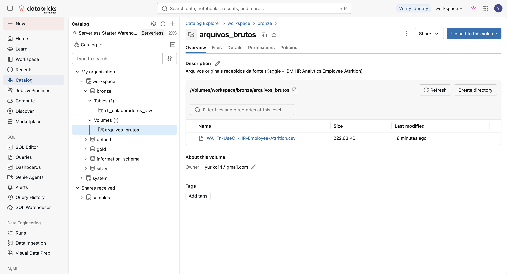
*Arquivo CSV armazenado no volume `workspace.bronze.arquivos_brutos`.*

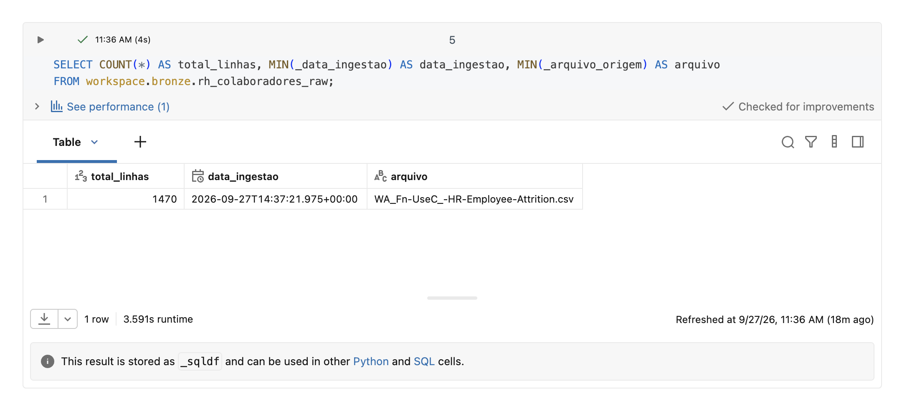
*Tabela Bronze criada e conferência de linhas.*

---

## 3. Modelagem e Catálogo de Dados (Etapa 4.3)

### Modelo escolhido: Esquema Estrela
O fato central é o **vínculo do colaborador** (granularidade: 1 linha por colaborador), com as métricas numéricas e o status de desligamento. As dimensões trazem os atributos descritivos usados para agrupar. Esse desenho foi escolhido porque todas as perguntas são do tipo *"taxa de turnover **por** X"*, e a estrela resolve isso com um JOIN por dimensão.

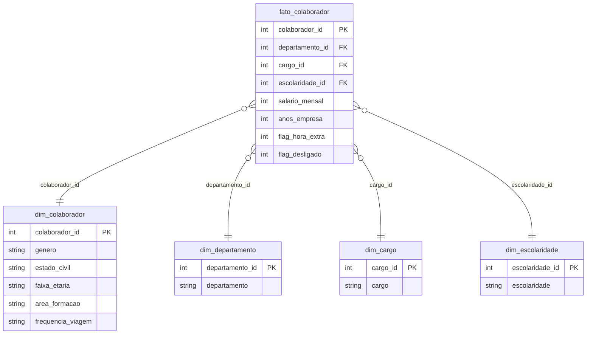

Observação de modelagem: cargo e departamento são dimensões separadas porque o cargo *Gerente* existe nos três departamentos.

### Organização em camadas (Arquitetura Medalhão)
| Camada | Objeto (Unity Catalog) | Linhas | Descrição |
|---|---|---|---|
| Bronze | `workspace.bronze.arquivos_brutos` (volume) | 1 arquivo | CSV original |
| Bronze | `workspace.bronze.rh_colaboradores_raw` | 1.470 | Cópia fiel do CSV, tudo texto + metadados |
| Silver | `workspace.silver.rh_colaboradores` | 1.470 | Limpa, tipada, traduzida, com faixas |
| Gold | `workspace.gold.fato_colaborador` | 1.470 | Fato do modelo estrela |
| Gold | `workspace.gold.dim_colaborador` | 1.470 | Perfil demográfico |
| Gold | `workspace.gold.dim_departamento` | 3 | Departamentos |
| Gold | `workspace.gold.dim_cargo` | 9 | Cargos |
| Gold | `workspace.gold.dim_escolaridade` | 5 | Níveis de escolaridade |

### Catálogo de Dados
O catálogo foi registrado **no próprio Unity Catalog**: toda tabela e toda coluna tem comentário (`COMMENT`) com descrição, domínio de valores e origem, e as chaves primárias/estrangeiras foram declaradas. Transcrição abaixo.

**Linhagem geral:** `CSV (Kaggle)` → `bronze.rh_colaboradores_raw` → `silver.rh_colaboradores` → `gold.dim_*` e `gold.fato_colaborador`.

#### `gold.fato_colaborador` – vínculo do colaborador (1 linha por colaborador)
| Coluna | Tipo | Descrição | Domínio | Origem (Bronze) / transformação |
|---|---|---|---|---|
| colaborador_id | INT (PK, FK) | Identificador do colaborador | 1 a 2068 (único) | `EmployeeNumber` |
| departamento_id | INT (FK) | Chave de `dim_departamento` | 1 a 3 | `Department` → traduzido → chave |
| cargo_id | INT (FK) | Chave de `dim_cargo` | 1 a 9 | `JobRole` → traduzido → chave |
| escolaridade_id | INT (FK) | Chave de `dim_escolaridade` | 1 a 5 | `Education` |
| nivel_cargo | INT | Nível hierárquico | 1 (entrada) a 5 (sênior) | `JobLevel` |
| idade | INT | Idade em anos | 18 a 60 | `Age` |
| salario_mensal | INT | Salário mensal (moeda não informada) | 1.009 a 19.999 | `MonthlyIncome` |
| faixa_salarial | STRING | Faixa salarial | 1. Até 2.999 · 2. 3.000–5.999 · 3. 6.000–9.999 · 4. 10.000+ | derivada de `MonthlyIncome` |
| perc_ultimo_aumento | INT | % do último aumento | 11 a 25 | `PercentSalaryHike` |
| nivel_stock_options | INT | Participação em ações | 0 a 3 | `StockOptionLevel` |
| distancia_casa | INT | Distância casa–trabalho (unidade não informada) | 1 a 29 | `DistanceFromHome` |
| faixa_distancia | STRING | Faixa de distância | 01-05 · 06-10 · 11-20 · 21-29 | derivada |
| anos_experiencia_total | INT | Anos de experiência total | 0 a 40 | `TotalWorkingYears` |
| qtd_empresas_anteriores | INT | Empresas anteriores | 0 a 9 | `NumCompaniesWorked` |
| anos_empresa | INT | Tempo de casa (anos) | 0 a 40 | `YearsAtCompany` |
| faixa_tempo_casa | STRING | Faixa de tempo de casa | 1. 0-1 ano · 2. 2-5 · 3. 6-10 · 4. Mais de 10 | derivada |
| anos_cargo_atual | INT | Anos no cargo atual | 0 a 18 | `YearsInCurrentRole` |
| anos_desde_promocao | INT | Anos desde a última promoção | 0 a 15 | `YearsSinceLastPromotion` |
| anos_com_gestor | INT | Anos com o gestor atual | 0 a 17 | `YearsWithCurrManager` |
| qtd_treinamentos_ano | INT | Treinamentos no último ano | 0 a 6 | `TrainingTimesLastYear` |
| nota_satisfacao_trabalho | INT | Satisfação com o trabalho | 1 Baixa · 2 Média · 3 Alta · 4 Muito alta | `JobSatisfaction` |
| nota_satisfacao_ambiente | INT | Satisfação com o ambiente | 1 a 4 (idem) | `EnvironmentSatisfaction` |
| nota_satisfacao_relacionamentos | INT | Satisfação com relacionamentos | 1 a 4 (idem) | `RelationshipSatisfaction` |
| nota_envolvimento | INT | Envolvimento com o trabalho | 1 Baixo a 4 Muito alto | `JobInvolvement` |
| nota_equilibrio_vida | INT | Equilíbrio vida–trabalho | 1 Ruim · 2 Bom · 3 Muito bom · 4 Excelente | `WorkLifeBalance` |
| nota_desempenho | INT | Avaliação de desempenho | 3 Excelente · 4 Excepcional | `PerformanceRating` |
| flag_hora_extra | INT | Faz hora extra? | 0 = não · 1 = sim | `OverTime` (Yes/No → 1/0) |
| flag_desligado | INT | **Saiu da empresa? (métrica principal)** | 0 = ativo · 1 = desligado | `Attrition` (Yes/No → 1/0) |

#### `gold.dim_colaborador`
| Coluna | Tipo | Descrição | Domínio | Origem |
|---|---|---|---|---|
| colaborador_id | INT (PK) | Identificador do colaborador | único | `EmployeeNumber` |
| genero | STRING | Gênero | Feminino, Masculino | `Gender` traduzido |
| estado_civil | STRING | Estado civil | Solteiro(a), Casado(a), Divorciado(a) | `MaritalStatus` traduzido |
| faixa_etaria | STRING | Faixa de idade | 18-25, 26-35, 36-45, 46-60 | derivada de `Age` |
| area_formacao | STRING | Área de formação | Ciências biológicas, Saúde, Marketing, Curso técnico, Recursos Humanos, Outra | `EducationField` traduzido |
| frequencia_viagem | STRING | Viagens a trabalho | Não viaja, Raramente, Frequentemente | `BusinessTravel` traduzido |

#### `gold.dim_departamento` · `gold.dim_cargo` · `gold.dim_escolaridade`
| Tabela | Coluna | Tipo | Descrição / domínio | Origem |
|---|---|---|---|---|
| dim_departamento | departamento_id | INT (PK) | Chave substituta (1–3), ordem alfabética | gerada (`DENSE_RANK`) |
| dim_departamento | departamento | STRING | Pesquisa e Desenvolvimento, Recursos Humanos, Vendas | `Department` traduzido |
| dim_cargo | cargo_id | INT (PK) | Chave substituta (1–9) | gerada (`DENSE_RANK`) |
| dim_cargo | cargo | STRING | Analista de RH, Cientista Pesquisador(a), Diretor(a) de Manufatura, Diretor(a) de Pesquisa, Executivo(a) de Vendas, Gerente, Representante de Saúde, Representante de Vendas, Técnico(a) de Laboratório | `JobRole` traduzido |
| dim_escolaridade | escolaridade_id | INT (PK) | 1 a 5 | `Education` |
| dim_escolaridade | escolaridade | STRING | 1 Ensino médio · 2 Superior incompleto · 3 Graduação · 4 Mestrado · 5 Doutorado | rótulo da documentação da fonte |

A tabela `silver.rh_colaboradores` contém a união de todas as colunas acima (em formato "largo") mais `_data_ingestao` e `_data_processamento`; todas as colunas também estão comentadas no Unity Catalog.

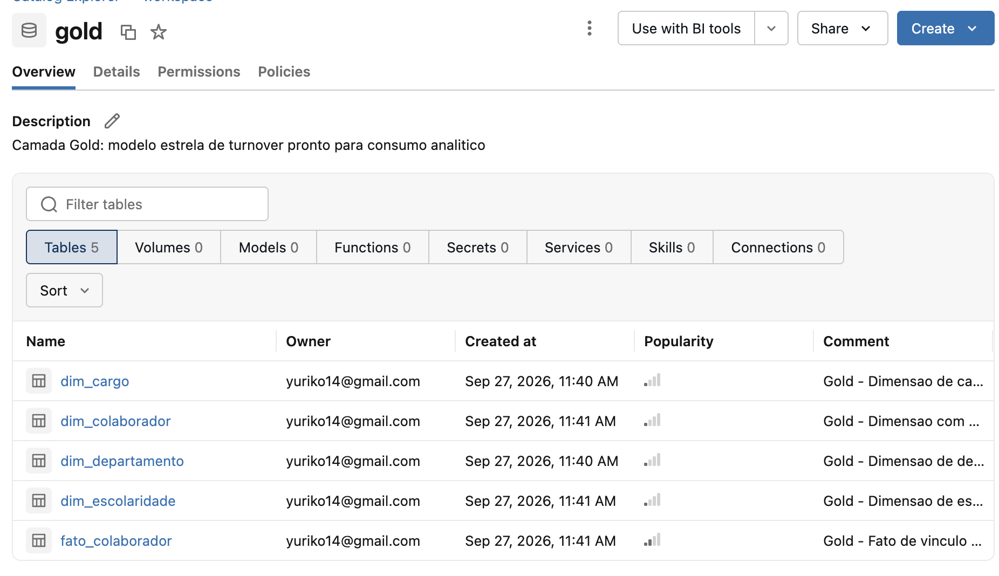
*Schemas bronze, silver e gold e suas tabelas no Catalog Explorer.*

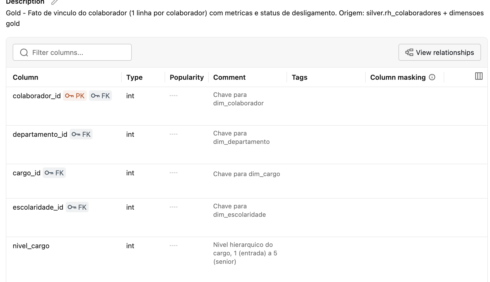
*Descrição das colunas de `fato_colaborador` registrada no Unity Catalog.*

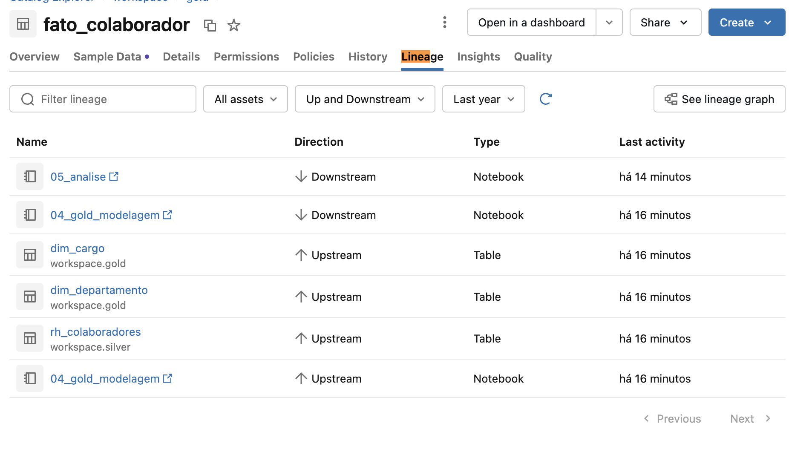
*Linhagem das tabelas gerada automaticamente pelo Unity Catalog.*

---

## 4. Pipeline de Dados (Etapa 4.4)

O pipeline foi **ramificado em um notebook por etapa**, todos em SQL, na ordem abaixo. O notebook `99_executar_pipeline.sql` roda tudo em sequência (`%run`), permitindo reprocessar quando um novo arquivo chegar ao volume.

| Ordem | Notebook | Lê de | Grava em | O que faz |
|---|---|---|---|---|
| 0 | [`00_setup.sql`](notebooks/00_setup.sql) | – | schemas + volume | Estrutura do Lakehouse |
| 1 | [`01_bronze_ingestao.sql`](notebooks/01_bronze_ingestao.sql) | volume (CSV) | `bronze.rh_colaboradores_raw` | **Extract**: leitura fiel + metadados |
| 2 | [`02_qualidade_dados.sql`](notebooks/02_qualidade_dados.sql) | Bronze | – (relatório) | Diagnóstico de qualidade (seção 5) |
| 3 | [`03_silver_transformacao.sql`](notebooks/03_silver_transformacao.sql) | Bronze | `silver.rh_colaboradores` | **Transform**: limpeza e padronização |
| 4 | [`04_gold_modelagem.sql`](notebooks/04_gold_modelagem.sql) | Silver | `gold.dim_*`, `gold.fato_colaborador` | **Load**: modelo estrela, PK/FK e catálogo |
| 5 | [`05_analise.sql`](notebooks/05_analise.sql) | Gold | – | Respostas às perguntas |

**Transformações documentadas (Bronze → Silver):**
1. **Deduplicação** por `EmployeeNumber` com `ROW_NUMBER()` (mantém o registro mais recente). Não havia duplicatas, mas a regra protege recargas futuras.
2. **Tipagem**: 21 colunas numéricas convertidas de texto para `INT`.
3. **Flags**: `Attrition` e `OverTime` (Yes/No) viraram `flag_desligado` e `flag_hora_extra` (1/0). Assim a taxa de turnover de qualquer grupo é `AVG(flag_desligado) × 100`.
4. **Remoção de 6 colunas** sem valor analítico: `EmployeeCount`, `Over18`, `StandardHours` (constantes) e `DailyRate`, `HourlyRate`, `MonthlyRate` (sem documentação e com correlação ≈ 0 com o salário mensal).
5. **Tradução/padronização** das categorias e dos nomes de colunas para português (ex.: `Research & Development` → `Pesquisa e Desenvolvimento`).
6. **Rótulos das escalas** (1 = Baixa … 4 = Muito alta; escolaridade 1–5).
7. **Faixas** de idade, salário, tempo de casa e distância, para análises menos sensíveis a outliers.

**Transformações (Silver → Gold):** criação das dimensões com chave substituta (`DENSE_RANK`), JOIN da Silver com as dimensões para montar a fato (ex.: *"realizei um JOIN entre a Silver e `dim_departamento` pelo nome do departamento para substituir o texto pela chave `departamento_id`"*), declaração de PK/FK e conferência de integridade (**0 linhas órfãs**).

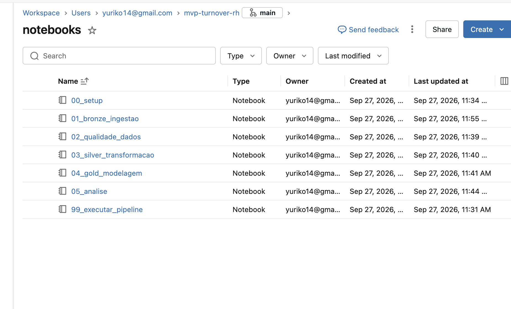
*Notebooks do pipeline no Databricks (Git folder conectado a este repositório).*

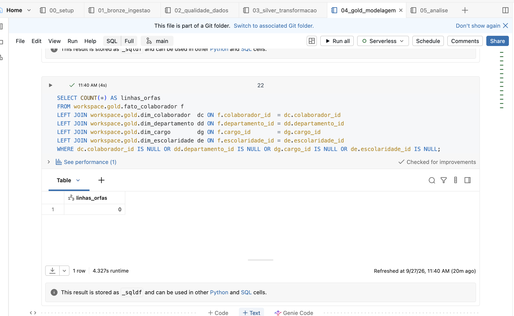
*Conferência final: fato com 1.470 linhas e 0 linhas órfãs.*

---

## 5. Qualidade de Dados (Etapa 4.5)

A verificação foi feita **atributo a atributo** sobre a Bronze, no notebook [`02_qualidade_dados.sql`](notebooks/02_qualidade_dados.sql).

| Dimensão | Verificação | Resultado |
|---|---|---|
| Completude | Nulos/vazios em cada uma das 35 colunas | **0 nulos** em todas |
| Consistência (tipo) | Valores não numéricos em colunas numéricas | **0** |
| Consistência (categorias) | Grafias diferentes, espaços, maiúsculas | Nenhuma inconsistência; categorias em inglês (traduzidas na Silver) |
| Unicidade | IDs repetidos e linhas duplicadas | **0** e **0** |
| Acurácia | 8 regras de negócio (ex.: tempo de empresa ≤ experiência total; tempo no cargo ≤ tempo de empresa; idade 18–70; salário > 0) | **0 violações** |
| Outliers (IQR) | Salário, tempo de empresa, experiência, tempo sem promoção, distância, idade | Salário: 114 · tempo sem promoção: 107 · tempo de empresa: 104 · experiência: 63 · distância e idade: 0 |

**Problemas encontrados e como foram tratados**
| # | Problema | Tratamento |
|---|---|---|
| 1 | Caractere invisível (BOM) no início do cabeçalho do CSV | Esquema explícito na leitura da Bronze |
| 2 | Todas as colunas chegam como texto | Tipagem na Silver |
| 3 | 3 colunas constantes (`EmployeeCount`=1, `Over18`=Y, `StandardHours`=80) | Removidas |
| 4 | `DailyRate`, `HourlyRate`, `MonthlyRate` sem significado documentado e sem relação com o salário (correlação ≈ 0) | Removidas; o salário usado é `MonthlyIncome` |
| 5 | Escalas numéricas sem rótulo | Rótulos em português documentados no catálogo |
| 6 | `PerformanceRating` só tem notas 3 e 4 (nenhuma avaliação baixa) – provável viés da base | Mantida, mas **não usada** como fator explicativo |
| 7 | Outliers em salário, tempo de casa e tempo sem promoção | **Mantidos**: são valores plausíveis (ex.: diretores com salário alto, profissionais com 40 anos de casa). As análises usam **faixas e taxas**, pouco sensíveis a extremos, e a mediana salarial |

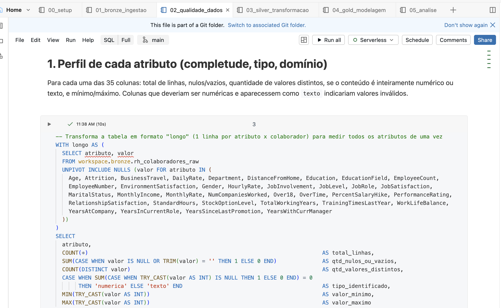
*Perfil dos atributos: nulos, distintos, mínimos e máximos.*

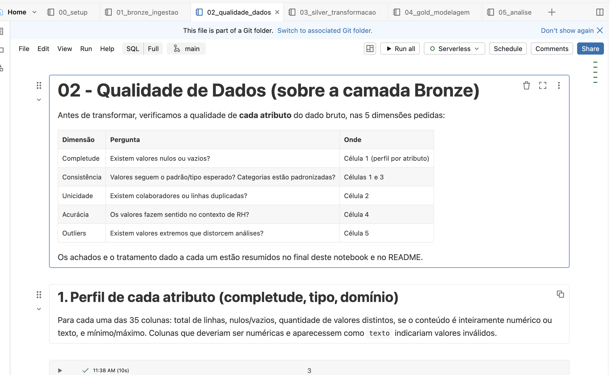
*Regras de negócio (0 violações) e contagem de outliers.*

---

## 6. Análise de Dados (Etapa 4.5)

Todas as consultas estão em [`05_analise.sql`](notebooks/05_analise.sql) e usam a camada Gold. **Taxa de turnover = desligados ÷ colaboradores do grupo × 100.**

### P1. Taxa geral, por departamento e por cargo
A taxa geral é de **16,1%** (237 de 1.470 colaboradores).

| Departamento | Colaboradores | Taxa |
|---|---|---|
| Vendas | 446 | **20,6%** |
| Recursos Humanos | 63 | 19,0% |
| Pesquisa e Desenvolvimento | 961 | 13,8% |

| Cargo | Colab. | Taxa | Salário médio |
|---|---|---|---|
| Representante de Vendas | 83 | **39,8%** | 2.626 |
| Técnico(a) de Laboratório | 259 | 23,9% | 3.237 |
| Analista de RH | 52 | 23,1% | 4.236 |
| Executivo(a) de Vendas | 326 | 17,5% | 6.924 |
| Cientista Pesquisador(a) | 292 | 16,1% | 3.240 |
| Representante de Saúde | 131 | 6,9% | 7.529 |
| Diretor(a) de Manufatura | 145 | 6,9% | 7.295 |
| Gerente | 102 | 4,9% | 17.182 |
| Diretor(a) de Pesquisa | 80 | 2,5% | 16.034 |

**Discussão:** o departamento de Vendas tem a maior taxa, mas a diferença fica mais clara no nível de **cargo**: os cargos operacionais e de entrada (Representante de Vendas, Técnico de Laboratório) perdem proporcionalmente de 3 a 16 vezes mais pessoas do que cargos de liderança (Gerente, Diretor). Os cargos com maior turnover também são os de menor salário médio, o que antecipa a P3.

### P2. Hora extra
| Hora extra | Colaboradores | Taxa |
|---|---|---|
| Faz | 416 | **30,5%** |
| Não faz | 1.054 | 10,4% |

**Discussão:** quem faz hora extra tem **~3 vezes** mais chance de sair. É o fator isolado com maior diferença entre grupos, e um fator **gerenciável** pelo RH (dimensionamento de equipe, banco de horas, monitoramento de carga).

### P3. Salário
| Status | Salário médio | Salário mediano |
|---|---|---|
| Ativos | 6.833 | 5.204 |
| Desligados | 4.787 | **3.202** |

| Faixa salarial | Colaboradores | Taxa |
|---|---|---|
| Até 2.999 | 395 | **28,6%** |
| 3.000–5.999 | 519 | 12,7% |
| 6.000–9.999 | 275 | 12,0% |
| 10.000+ | 281 | 8,9% |

**Discussão:** o salário mediano de quem saiu é ~38% menor. O efeito se concentra na **faixa mais baixa** (até 2.999), com mais que o dobro da taxa das faixas seguintes. A partir de 3.000 a taxa se estabiliza entre 9% e 13%. Isso sugere que existe um "piso" salarial abaixo do qual a retenção fica crítica.

### P4. Tempo de casa e idade
| Tempo de casa | Colab. | Taxa | | Faixa etária | Colab. | Taxa |
|---|---|---|---|---|---|---|
| 0–1 ano | 215 | **34,9%** | | 18–25 | 123 | **35,8%** |
| 2–5 anos | 561 | 15,5% | | 26–35 | 606 | 19,1% |
| 6–10 anos | 448 | 12,3% | | 36–45 | 468 | 9,2% |
| Mais de 10 anos | 246 | 8,1% | | 46–60 | 273 | 12,5% |

**Discussão:** o risco é máximo no **primeiro ano** (1 em cada 3 sai) e cai de forma consistente com o tempo de casa. Jovens de 18 a 25 anos também saem mais. Isso aponta para **onboarding e primeiros 12 meses** como ponto crítico de retenção.

### P5. Clima: satisfação, envolvimento e equilíbrio
| Indicador | Nota 1 (pior) | Nota 2 | Nota 3 | Nota 4 (melhor) |
|---|---|---|---|---|
| Envolvimento com o trabalho | **33,7%** | 18,9% | 14,4% | 9,0% |
| Equilíbrio vida–trabalho | **31,3%** | 16,9% | 14,2% | 17,6% |
| Satisfação com o ambiente | **25,4%** | 15,0% | 13,7% | 13,5% |
| Satisfação com o trabalho | **22,8%** | 16,4% | 16,5% | 11,3% |
| Satisfação com relacionamentos | 20,7% | 14,9% | 15,5% | 14,8% |

**Discussão:** em todos os indicadores, a **nota 1** tem a maior taxa de saída. As relações mais fortes são **envolvimento** e **equilíbrio vida–trabalho** (este último conversa com o achado de hora extra). A partir da nota 2 as diferenças diminuem, ou seja, o sinal de alerta está em quem avalia o clima como **ruim**, e não tanto em diferenças entre "bom" e "ótimo". Satisfação com relacionamentos tem o efeito mais fraco.

### P6. Promoção, distância e viagens
| Tempo sem promoção | Taxa | | Distância | Taxa | | Viagens | Taxa |
|---|---|---|---|---|---|---|---|
| Menos de 1 ano* | 18,9% | | 01–05 | 13,8% | | Frequentemente | **24,9%** |
| 1–3 anos | 15,0% | | 06–10 | 14,5% | | Raramente | 15,0% |
| 4–6 anos | 9,4% | | 11–20 | 20,0% | | Não viaja | 8,0% |
| 7+ anos | 15,8% | | 21–29 | **22,1%** | | | |

\*inclui recém-contratados, que ainda não tiveram promoção.

**Discussão:** **viagens frequentes** (24,9% vs 8,0%) e **distância acima de 10** (20–22% vs ~14%) estão associadas a mais saídas, reforçando o tema de desgaste/equilíbrio. Já **tempo sem promoção não mostrou relação clara**: a taxa não cresce com os anos sem promoção, e a faixa mais alta é justamente a que mistura recém-contratados. Portanto, nesta base, a hipótese "falta de promoção causa saída" **não se confirmou**.

### P7. Perfil de maior risco (grupos com ≥ 20 pessoas)
| Hora extra | Faixa salarial | Tempo de casa | Colab. | Taxa |
|---|---|---|---|---|
| Sim | Até 2.999 | 0–1 ano | 36 | **75,0%** |
| Sim | Até 2.999 | 2–5 anos | 51 | 49,0% |
| Sim | Até 2.999 | 6–10 anos | 25 | 48,0% |
| Não | Até 2.999 | 0–1 ano | 86 | 33,7% |
| Sim | 6.000–9.999 | 2–5 anos | 31 | 25,8% |

**Discussão:** os fatores se **somam**. Um colaborador recém-contratado, com salário na faixa mais baixa e que faz hora extra, tem taxa de **75%**, quase 5 vezes a média da empresa. Esse é o público prioritário para ações de retenção.

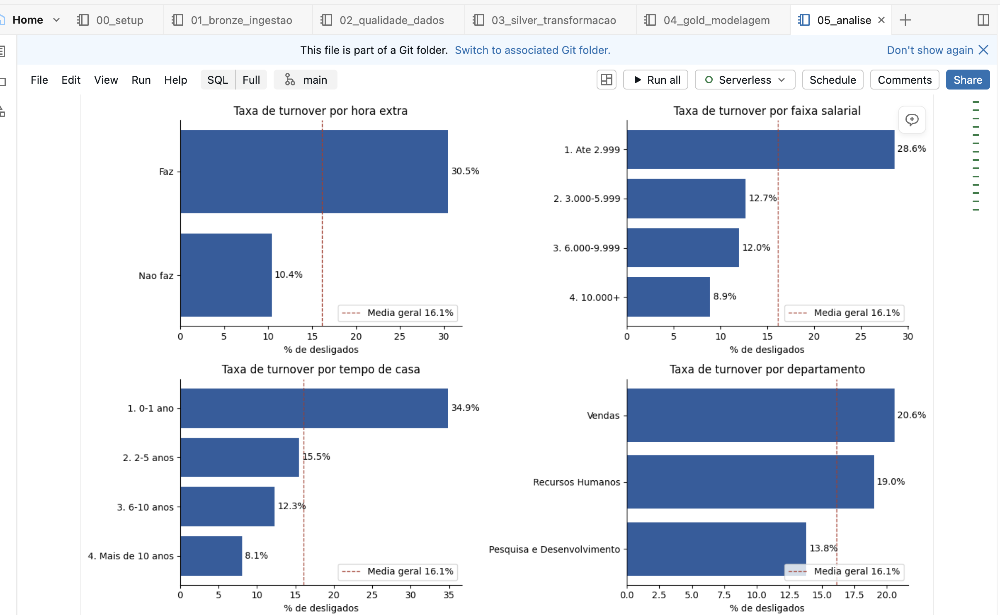
*Painel com taxa de turnover por hora extra, faixa salarial, tempo de casa e departamento (linha tracejada = média geral).*

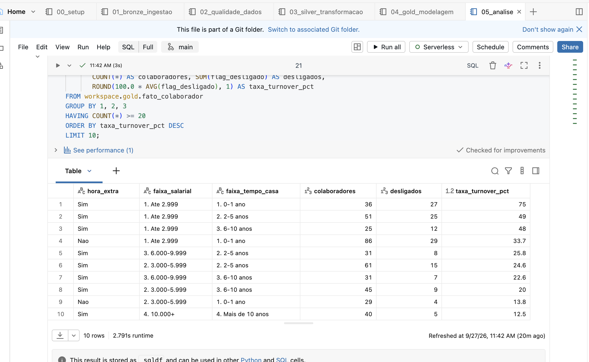
*Resultado da P7 no Databricks.*

### Discussão geral
Voltando ao problema (*quais fatores estão associados ao turnover e onde agir*), a análise aponta três frentes, em ordem de impacto:

1. **Carga de trabalho:** hora extra (×3), viagens frequentes e baixo equilíbrio vida–trabalho. É a alavanca mais direta de gestão.
2. **Remuneração na base:** a faixa até 2.999 concentra 48% dos desligamentos (113 de 237). Revisar o piso salarial dos cargos de entrada (Representante de Vendas, Técnico de Laboratório) tende a ter mais efeito do que aumentos gerais.
3. **Primeiro ano:** 35% de saída no primeiro ano sugere reforçar onboarding, acompanhamento de 30/60/90 dias e pesquisa de clima precoce, olhando especialmente para quem dá nota 1 em envolvimento.

**Limitações:** (a) a base é **fictícia**, então os números servem para demonstrar o método e não descrevem uma empresa real; (b) a análise mostra **associação, não causa**. Por exemplo, jovens também tendem a ter salários menores e menos tempo de casa, e os fatores se sobrepõem; (c) é uma **fotografia única**, sem data de desligamento, o que impede ver a evolução no tempo; (d) moeda e unidade de distância não são informadas pela fonte.

---

## 7. Autoavaliação

**Objetivos atingidos.** O pipeline foi construído de ponta a ponta na nuvem (Databricks Free Edition): ingestão do arquivo bruto em volume, camadas Bronze, Silver e Gold em Delta Lake, modelo estrela com chaves declaradas, catálogo de dados registrado no Unity Catalog e análise em SQL. **As 7 perguntas foram respondidas**: seis com uma resposta clara e uma (P6, tempo sem promoção) com a conclusão de que a hipótese **não se confirmou** nesta base, o que também é um resultado.

**Dificuldades.** Venho do RH e não da área técnica, então o maior desafio foi traduzir perguntas que faço no dia a dia ("por que as pessoas estão saindo?") em decisões técnicas: granularidade da tabela fato, o que manter ou descartar, como criar faixas. Outros pontos: o caractere invisível (BOM) no cabeçalho do CSV, que alterava o nome da primeira coluna, e decidir o que fazer com colunas sem documentação (`DailyRate`, `HourlyRate`, `MonthlyRate`). Optei por removê-las e registrar o motivo, em vez de usá-las sem entender o significado.

**O que eu faria diferente / trabalhos futuros.**
- Usar dados **reais e anonimizados** de uma empresa, com **data de admissão e de desligamento**, para calcular o turnover mensal e separar desligamento voluntário de involuntário.
- Agendar o pipeline como um **Job** do Databricks e trocar a carga completa por carga **incremental**.
- Adicionar **testes automáticos de qualidade** (expectations) que interrompam o pipeline se uma regra for violada.
- Aplicar um modelo de **Machine Learning** (ex.: regressão logística) para medir o peso de cada fator controlando pelos outros, separando associação de causa.
- Construir um **dashboard** (Databricks AI/BI) sobre a camada Gold para o time de RH acompanhar os indicadores.
